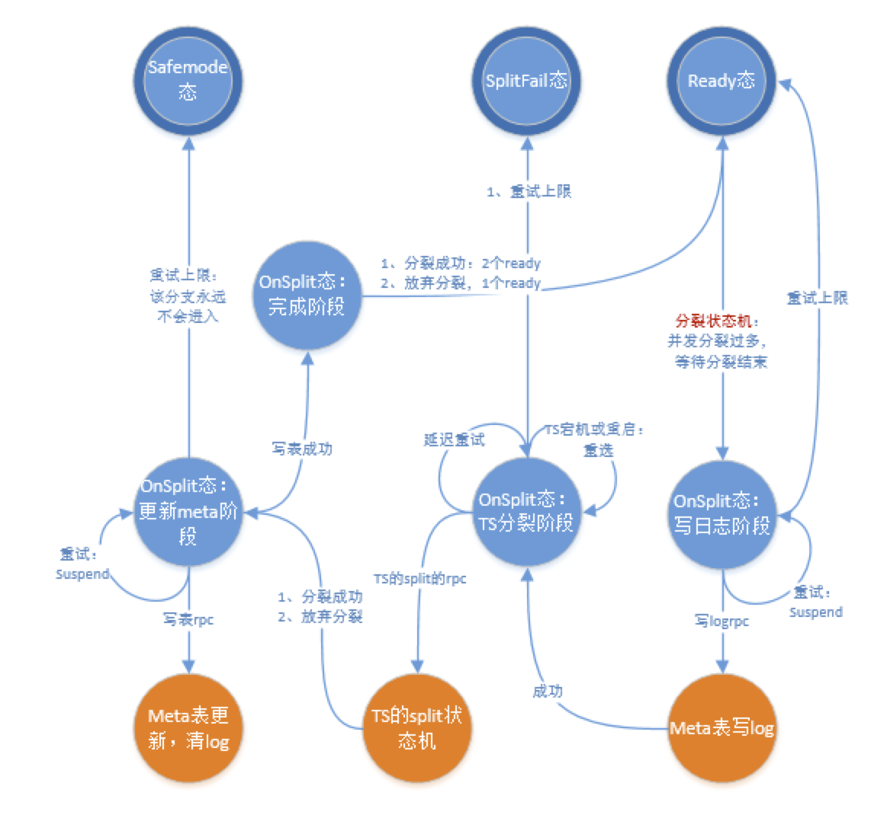
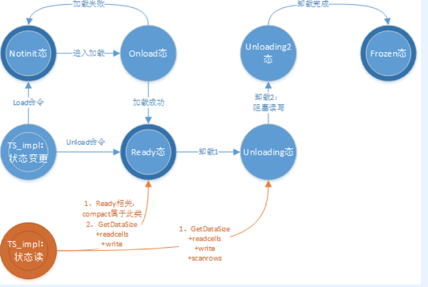

#Tera的TODO List
##Task001——SplitTablet的状态机
### master端的分裂设计

#### 分裂总体设计

1、    QueryTablet：master从TS定点收集到某个Tablet的workload；若workload达到上水位，执行PickSplitKey，获得分裂点；触发后续分裂操作；

2、    通过AllocTabletName()：获得一个Table级唯一的tablet名（例如，旧子表为TabletA，新表名产生为TabletB）；

    a) 复用目前的tablet号生成机制；
    注意1：步骤1,2可以重复执行，任意一步崩溃也不会造成表不一致；
    注意2：从后面步骤开始，切换上下文，进入状态机；

3、    TableA的meta表插入一条日志：tabletA分裂为tabletA+tabletB，分裂点splitkey；

    注意1：后续任何一个步骤发生故障，master重启，读取日志，从步骤4开始，继续完成分裂；
    注意2：该阶段客户端的读写不影响；
    注意3：该步骤具有原子性；

4、    发送TS的split命令：

    a）TS执行unload；结合splitkey，重加载两个Table；
    b）master对失败的步骤：立即重试；延迟重试；强杀TS；
    注意1：用户请求从此阶段开始被阻塞；
    注意2：master重启后，需要先根据事件日志恢复；
    注意3：TS的rpc失败，区分：网络故障，TS失败应答；（细分交互的状态）；
    注意4：split命令必须在TS端可重入；可放弃；
    注意5：该操作必须尽可能快速完成，降低用户的阻塞时间；
    注意6：包含统计信息，度量阻塞时间，阻塞请求数，分裂时间（优先级低）；
    
5、    插入两条meta表记录：TabletA=>TS和TabletB=>TS；删除TabletA的日志；
    
    注意1：分裂与迁移解耦合，分裂之后没有马上将tablet迁移到其他节点，利用本节点的cache局部性；
    注意2：该阶段客户端能继续读写；
    注意3：该步骤可重入；可放弃；
    
#### 分裂详细设计
  
 **master启动流程修改**：RestoreUserTablet()

	1、收集所有包含日志的tablet，并将日志tablet设置为Onsplit态
	2、遍历每个活跃tablet的meta
		2.1、若该meta的keyrange是日志tablet的子区间
				若meta对应的TS存活
					设置日志tablet的serveradd和serverid
		2.2、若该meta的keyrange是日志tablet的区间一致
				若meta的TS存活
					设置日志tablet的serveradd和serverid
		2.3、不属于2.1和2.2条件，执行verify判断：
				若判断失败
					unload
				否则，
					设置内存tablet为ready
	3、对所有日志tablet，重选向TS发送分裂（分裂第二阶段）
	4、将所有notinit的tablet设置为offline；执行tryload操作；  

**日志设计**：

TabletMeta的修改：增加一个TabletOpLog字段，该字段的定义，如下：

	enum LogType {
    	optional allow_alias = true;
    	kSplitLog = 10;	
    }
	
	message TabletOpLog {// 复用parent tablet的字段
		optional LogType type = 1;
		
		// for split
		optional bytes mid_key = 2;//用于分裂的key
		optional uint64 lchild_tablet;
		optional uint64 rchild_tablet;
	}

**分裂接口**：SplitTablet
	
	接口：bool MasterImpl::SplitTablet(TabletPtr tablet, uint32_t phase)
	参数说明：phase指示此时分裂进入哪个阶段
	
**具体流程**：
	
	分裂竞争阶段：splittablet(tablet, phase0)
	1、分裂的合理性检查；若不通过，则放弃本轮分裂；
	2、准备log：获得mid_key，分配lchild_no,rchild_no
	-----------------------------------------------
	3、若需要延迟，则延迟分裂；
	4、若竞争成功，设置onsplit状态，构造tabletlog；
	   若竞争失败，则放弃本轮分裂；
	5、进入下一个阶段
		
	分裂阶段1：splittablet(tablet, phase1)
	写log【meta表发送】：
		1、构造request，response
		2、构造callback
		3、发送rpc
		注意：该步骤，可以是meta的异步写，能被复用
	写log【回调】：
		1、若失败，则重选metaTS，延迟，调用写log【meta表发送】
		2、若成功，则进入下一个阶段
		
	分裂阶段2：splittablet(tablet, phase2)
	TS的split【开始】：tablet带TS地址
		1、构造request，response
		2、构造callback
		3、发送rpc
	TS的split【回调】：
		1、若TS宕机，重选TS，调用TS的split【开始】
		2、若TS重启，调用TS的split【开始】
		3、若rpc超时TS未应答，调用TS的split【开始】
		4、若TS应答失败，调用TS的split【开始】
		5、若TS应答成功，则进入下一个阶段

	分裂阶段3：splittablet(tablet, phase3)
	清log【开始】：
		1、构造tabletB和tabletC的插入的TabletMeta
		2、构造tabletA的删除的TabletMeta
	清log【meta表发送】：tablet带TS地址
		1、构造request，response
		2、构造callback
		3、发送rpc
		注意：该步骤，可以是meta的异步写，能被复用
	清log【回调】：
		1、若失败，则重选metaTS，延迟，调用清log【meta表发送】
		2、若成功 
			2.1、删除tabletA的内存结构，插入tabletB和tabletC的内存结构{处于ready态}
			2.2、重启该节点的其他分裂

**master端的状态图**

### TS端分裂分析与设计
#### TS端分裂旧流程分析

**TS端的【旧分裂流程】的上半段：**

    1、获得分裂rpc
    2、加入处理队列
    3、执行TabletNode_impl->SplitTablet
    4、查询tabletIO，增加引用计数；若不存在，则返回失败；
    5、tabletIO->split()
        5.1、若tablet非ready或正在compact，则放弃分裂；
        5.2、设置onsplit状态；
        5.3、收集所有LG占用的数据大小（注意在LG锁内执行？？）
            5.3.1、遍历所有LG的大小
        5.4、计算splitkey
            5.4.1、遍历所有LG的大小
            5.4.2、选择LG大小最大的LG，选择其分裂key
            注意1：产是哪个的分裂key是user的类型，但外部调用却认为是terakey？
                terakey从levelDB的角度是userkey；
                TabletIO负责terakey的编解码工作；
            注意2：如何保证分裂key是行边界？
                选择完原始分裂key后，行边界调整；
                leveldb/util/raw_key_operator.cc
        5.5、tabletIO设置位splited状态；
    6、TabletIO->unload()
        6.1、检查是否处于分裂的卸载阶段；
        6.2、设置unloading态
        6.3、执行DBTable->shutdown1();
            6.3.1、每个LG执行shutdown1
                步骤1：设置关闭标志
                步骤2：对imm执行dump
                步骤3：等待写完成
                步骤4：队mem执行dump
            6.3.2、等待后台清理日志线程完成，删除日志
        6.4、设置unloading2态
        6.5、等IO结束
        6.6、停止异步写，排空内存的所有排队写请求(内存暂存)
            该步骤完成将内存的请求，排空到DBTable的异步日志写线程；
        6.7、若成功，则执行DBTable->shutdown2();
            6.7.1、关闭进入第二阶段
            6.7.2、每个LG执行shutdown2：执行memtable的dump
            6.7.3、停止异步日志，删除日志文件（实际的日志写上下文）
    7、将tabletIO的内存结构删除
    8、发起异步的meta表更新操作
        8.1、从zk获得meta表的位置（执行一个远端操作？？）
        8.2、更新前半段和后半段
        8.3、发送metaTS的rpc请求

**TS端的【旧分裂流程】的中半段：**        
    
    1、若meta表更新失败，则返回master更新失败
    2、更新成功，则返回master更新成功；

**TS端的【旧分裂流程】的后半段：**

    1、获得加载rpc
    2、将TabletIO结构插入管理链；若增加失败，则退出
    3、TabletIO->load()
        3.2、若tabletIO为ready，且keyrange正确，则加载完成
        3.3、若tabletIO不是notinit态，则加载失败
        3.4、设置tabletIO为onload态；
        3.5、设置ldb_operations的各个字段
        3.6、打开DBTable，执行初始化操作：
            3.6.1、每个LG执行操作：
                步骤1：创建DBImpl对象
                步骤2：设置snapshot点
                步骤3：执行recovery操作，每个LG的恢复步骤（重要！！！）：
                    @1：创建数据库目录，lockfile
                    @2：若parent_tablets为空，则创建一个新的ldb，创建manifest和current文件
                    @3：执行versionset->recover(),重构manifest文件
                    	@@1：读取current文件：正常流程1个，分裂流程1个，合并流程2个current文件
                    	@@2：读取每个manifest中的记录
                    		=》利用edit更新version的信息
                    		=》调整edit中FileMetaDate的区间
                    		=》创建current version，插入versonset
                步骤4：设置写序列号和最小序列号
            3.6.2、若LG操作失败，则删除是所有LG，出错返回
            
            ##### 下面是数据恢复流程 #####
            3.6.3、收集待用于数据恢复的日志文件
            3.6.4、从旧日志到新日志的顺序，读取每一条日志，执行数据恢复，并产生每个lg的versionEdit
                步骤1：打开日志文件
                步骤2：读取每一条日志记录
                步骤3：从日志记录解析出更新，并根据LG进行切分
                步骤4：更新序列号
                步骤5：对于每一个LG：
                    若记录比LG持久化的更新旧，则忽略该记录；
                    否则，将记录插入导recovery_mem中，内存达到水位线，则dump内存
            3.6.5、对每个LG执行操作：
                步骤1：将recovery_mem的内容写入level0；
                步骤2：利用lg_edit，更新manifest文件
                步骤3：删除不识别，过期的文件
                步骤4：触发压缩调度
            3.6.6、删除日志文件
            3.6.7、启动一个异步写日志线程；
        3.7、若打开失败，则tabletIO设置为notinit态，出错返回
        3.8、若打开成功，则创建一个异步写上下文（延迟小IO，拼成大IO）
        3.9、设置tabletIO为ready态，成功返回
    4、若load失败，则tabletIO从内存管理结构删除    
    5、请求返回
    
**注意：**整个分裂流程完成后，都没有删除parent的manifest文件

#### TS端新分裂流程设计
**分裂总体流程：**
	
	-----------------------------
	分裂前半段：
		1、tabletIO执行load A
		2、tabletIO执行unload A
	-----------------------------
	分裂后半段：
		3、tabletIO执行load B
		4、tabletIO执行load C
	-----------------------------
	
**分裂接口的细化流程：**
	    	
    若TabletA不在内存且 {tabletB和tabletC在内存}，则退出
    
    stage=阶段1
    若TabletA不在内存
    	若{tabletB或tabletC的ldb有效}
    		TabletA设置为frozen态
    		stage=阶段2；
    	否则
    		tabletA设置notinit态
    		stage=阶段1
    	TabletA插入内存；若插入失败，则退出
    	
    若tabletA在内存
    	若(stage == 阶段1)
    		load A
    		unload A：卸载将tabletA设置frozen态
    		若卸载成功
    			stage=阶段2；
    		否则，退出
    	若(stage == 阶段2)
    		申请TableB和TabletC的内存结构，设置notinit态；
    		load B
    		load C
    	删除tabletA的内存，插入B和插入C
    
    注意：load和unload是可重入的

**TS的收集counter流程修改**:TabletIO::GetAndClearCounter()
	
	增加GetMidKey的操作，获得tablet的中间大小对应的key，设置到counter字段中

**TS端的状态图**

 	
 	
 	
 	

    
