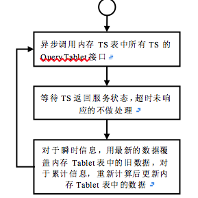
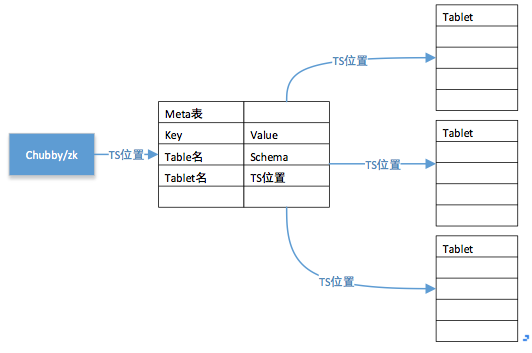
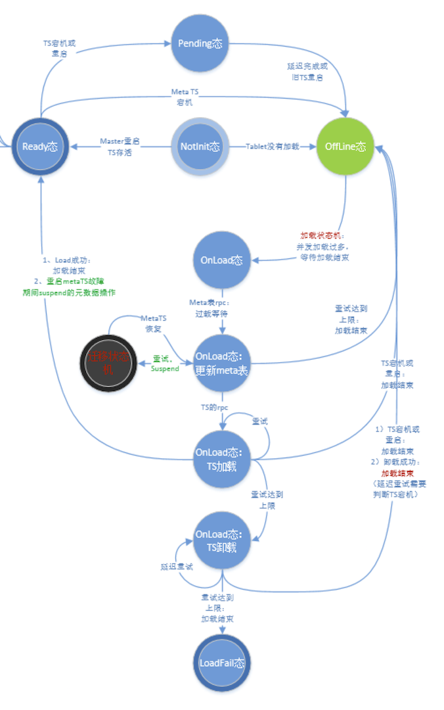
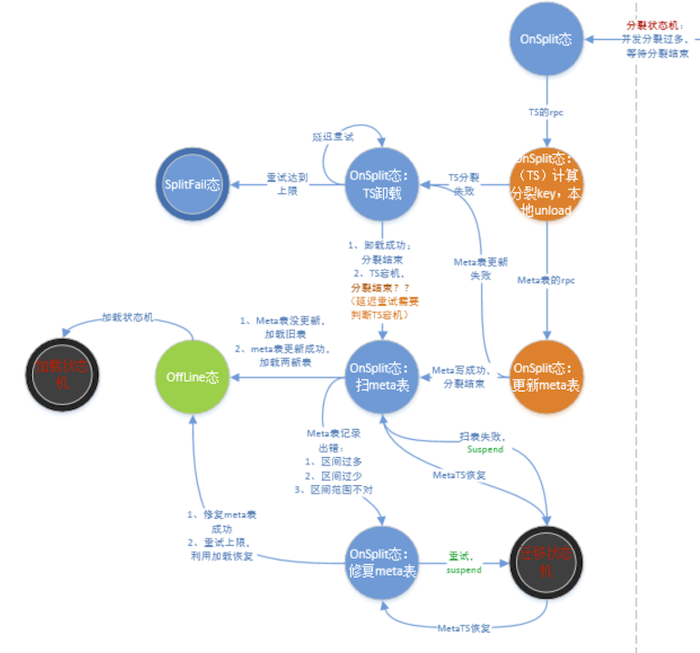
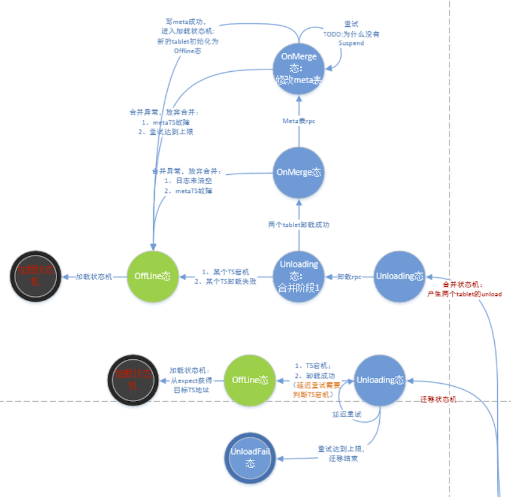
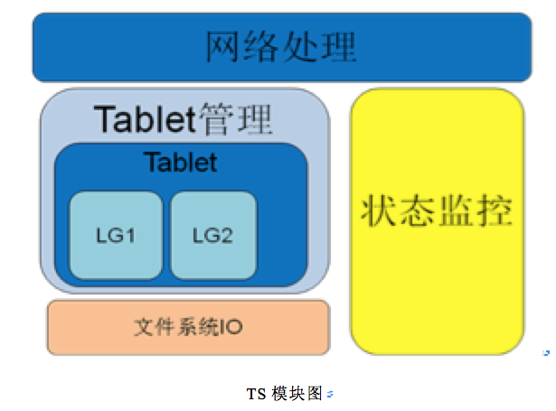

CJM：本文档是根据**设计文档**产生的**阅读文档**，**与代码实现不能完全对应**，代码对应工作将随着后续的代码阅读与开发进行修正。

版本0.1
#目 录

	Tera流程总结文档
	1 Master的设计
	1.1 Master主要流程
	1.1.1 启动流程
	1.1.2 关闭流程
	1.1.3 加载tablet流程
	1.1.4 卸载tablet流程
	1.1.5 Tablet的reassignment
	1.1.6 迁移tablet流程
	1.1.7 分裂tablet流程
	1.1.8 合并tablet流程
	1.1.9 Tablet表状态定时收集
	1.1.10 负载均衡决策
	1.1.11 表格创建流程
	1.2 Master的数据结构
	1.2.1 Meta表结构
	1.2.2 Tablet寻址模型
	1.2.3 表的schema	
	1.2.4 表格的key设计：
	1.2.5 Master的内存数据结构
	1.2.6 ZK数据结构
	1.2.7 DFS目录结构
	2 TS的设计
	2.1 TS主要流程
	2.1.1 启动流程
	2.1.2 加载Tablet	
	2.1.3 操作日志
	2.1.4 卸载Tablet	
	2.1.5 Master的分裂总体流程
	2.1.6 Master的合并流程
	2.2 TS的数据结构
	2.2.1 TabletNodeImpl
	2.2.2 TabletManager	
	2.2.3 DBTable
	2.2.4 DBImpl

 
#1 Master的设计
##1.1 Master主要流程
###1.1.1 启动流程
	1、在zk中注册并获得master的锁；（保证集群单实例）
	2、扫描zk的TS目录，获得活跃TS列表；
		注意：Master启动后，定期更新该表；master采用zk的watch机制观察TS是否存活；
	3、For each TS in TS列表
		a) QueryTablet()获得该TS的管理Tablet列表；
	4、master从zk获得meta Tablet位置；
		a) 若meta tablet所对应的文件在zk不存在，则master创建该文件。
		b) 若meta Tablet未被TS加载，则从获得TS列表选择meta TS；
			i. 将metaTS位置写入zk文件；（严格按照该序执行）
			ii. 执行load meta Tablet；
		注意：初始时，meta Tablet为空表，meta 表的位置是默认的，集群参与者master或TS都在启动配置文件中指定。先改zk文件，再执行load命令，保证防止master崩溃造成的频繁多TS加载同一个meta tablet。
	5、master从meta TS获得扫描meta table：
		a) 若发现某些tablet（table+startkey为tablet的标示）的区间缺失（底层文件系统）或重叠（由于split或merge的崩溃）：
			i. 若区间重复，则选择长区间，删除短区间（split相当于回滚，merge相当于完成）。
			ii.	若区间缺失，则相当于该区间的tablet数据丢失；填入空白项；（一个尝试修复操作是产生扫描该用户表的所有tablet，从孤儿tablet重试恢复用户数据）；
		b) 所有table的tablet列表；
	6、根据步骤3）和步骤5），产生unload tablet list；
		a) 若发现meta表记录tablet不属于TS，但TS包含该tablet，则master在unload时崩溃，该tablet需要被unload完成后，才能被重新load；
		b) 若发现meta表记录tablet属于TS，但TS不包含该tablet，则master在load时崩溃（TS崩溃也有可能出现该情况，splittablet时master崩溃），该tablet需要被load完成。
	7、for each tablet in unload tablet list
		a) 选择TS作为tablet的候选；
		b) 更新meta表中该tablet对应的项，加入TS信息；
		c) 执行rpc.LoadTablet(TS, Tablet)，该TS加载Tablet；
		d) 加载完成，更新TS的tablet列表；
	8、master启动完成，后台线程定期更新活跃TS列表和Tablet列表；
###1.1.2 关闭流程
	1、正常关闭与异常关闭一致；直接进行进程的kill操作；
	注意：目前代码区分正常卸载和宕机
###1.1.3 加载tablet流程
	1、根据活跃TS列表，选择一个后续TS，准备接管tablet；
	2、添加meta表的tablet项；
	3、执行rpc.LoadTablet(TS, Tablet)命令，等待直到加载成功；
	4、若TS失败，则重新执行步骤1）；
###1.1.4 卸载tablet流程
	1、清空meta表的tablet项；（master崩溃重启时，通过检查出不一致，进行恢复）
	2、向TS发送rpc.UnloadTablet命令，卸载tablet；
	3、若TS失败，则重新执行步骤2），卸载成功前，不能被reload；
	注意：master重启时，通过比较活跃TS管理tablet列表和meta table的已接管列表，发现不一致，master恢复。
###1.1.5 Tablet的reassignment
	1、每个TS上线时，往zk注册文件并获得互斥锁；
	2、当TS与zk的心跳网络断开后，TS自杀；
	3、Master启动时，watch每个TS；
	4、当每个TS与zk连接故障后，zk通知master出现TS宕机；
	5、Master获得该TS的锁；
	6、Master删除该文件；
	7、For each tablet in TS
		a)执行加载tablet接口
###1.1.6 迁移tablet流程
	1、旧TS卸载tablet
	2、新TS加载tablet
###1.1.7 分裂tablet流程
####1.1.7.1 方案1
	1、对tablet所在的TS发送rpc.SplitTablet命令；等待并获得splitkey，此时旧的tablet被unload；
	2、meta table的tablet插入新区间；
	3、meta table的tablet压缩旧区间；
	4、LoadTablet新区间；
	5、LoadTablet修改区间；
####1.1.7.2 方案2
	1、Tablet执行SplitTablet命令；创建前半段tablet，更新旧tablet的manifest，返还splitkey；
	2、插入meta表的新tablet项；
	3、加载新tablet；
###1.1.8 合并tablet流程
####1.1.8.1 方案1
	1、对于两个待合并的tablet，若两者key不连续，则合并失败；
	2、若两tablet不在同一个TS上，则迁移tablet到同一个TS；
	3、调用mergeTablet：unload两个tablet，合并两个tablet；
	4、meta table的tablet扩展旧区间；
	5、meta table的tablet删除新区间；
	6、加载旧tablet；
	7、加载新tablet；
####1.1.8.2 方案2
	1、合并tabletA和tabletB，若两者key不连续，则合并失败；
	2、Unload前半段tablet；
	3、调用mergeTablet：更新后半段tablet的manifest；
	4、Meta table删除前半段tablet记录；
###1.1.9 Tablet表状态定时收集


从该流程可以获知活跃TS表和tablet内存表的作用。
###1.1.10 负载均衡决策
	TODO：目前的收集信息是什么？
	可结合看size和load的调度器
###1.1.11 表格创建流程
	1、若table名存在，则创表失败；
	2、Meta表插入schema；
	3、DFS创建table名对应的目录；
	4、DFS创将tablet名对应的目录；
	5、选择一个TS，执行加载Tablet；
	注意：master端不涉及DFS的操作，尽快将master端流水起来；
##1.2 Master的数据结构
###1.2.1 Meta表结构
####1.2.1.1 方案1的元数据表

key|value
---|---
Table Name|schema
Table Name + start key | IP:port, endkey, path

####1.2.1.2 方案2的元数据表
Key|Value
---|---
Table Name|scheam
Table Name + endkey| IP:port, path

###1.2.2 Tablet寻址模型

Master进行TS的选择，并管理tabelt；客户端读取并缓存meta表，获得user tablet的位置；一旦客户端的位置信息失效，再从重新读取meta表。
###1.2.3 表的schema
span | 属性名 | 意义 | 有效取值 | 单位 | 默认值 | 其它说明
---  | ---    | ---  | ---      | ---  | ---    | --- 
table | rawkey | rawkey的拼装模式 | "readable"：性能较高，但不允许包含`\0`。"binary"：性能差一些，允许所有字符。 | - | "readable" | 
table | splitsize | 某个tablet增大到此阈值时分裂为2个子tablets| >=0，等于0时关闭split | MB | 512 | 
table | mergesize | 某个tablet减小到此阈值时和相邻的1个tablet合并 | >=0，等于0时关闭merge | MB | 0 | splitsize至少要为mergesize的5倍 
lg    | storage   | 存储类型 | "disk" / "flash" / "memory" | - | "disk" | 
lg    | compress  | 压缩算法 | "snappy" / "none" | - | "snappy" | 
lg    | blocksize | LevelDB中block的大小       | >0 | KB | 4 | 
lg    | use_memtable_on_leveldb | 是否启用内存compact | "true" / "false" | - | false | 
lg    | sst_size  | 第一层sst文件大小 | >0 | Bytes | 8,000,000 | 
cf    | maxversions | 保存的最大版本数  | >0 | - | 1 | 
cf    | minversions | 保存的最小版本数 | >0 | - | 1 | 
cf    | ttl | 数据有效时间 | >=0，等于0时此数据永远有效 | second | 0 | 小于0表示提前过期；和minversions冲突时以minversions为准

<!--
lg    | memtable_ldb_write_buffer_size | 内存compact开启后，写buffer的大小 | >0 | MB | 1 | 一般不用暴露给用户
lg    | memtable_ldb_block_size |  内存compact开启后，压缩块的大小 | >0 | KB | 4 | 一般不用暴露给用户
cf    | diskquota   | 存储限额  | >0 | MB | 0 | 暂未使用
-->

###1.2.4 表格的key设计：
变长	|变长|变长|2Bytes|2Bytes	|7Bytes|1Bytes
---|---|---|---|---|---|---
RowKey	|列族名+\0	|Column Qualifier|	行名长度	|列名长度|时间戳|类型

该key从levelDB的角度看，是user key。通过设置key的时间戳，配合schema中执行的版本数量，可以对数据进行版本控制；与此同时，表格的多种删除操作采用【类型】字段标识；对key的控制逻辑可以做在levelDB执行compact时对key的drop策略中。

	目前支持的删除包括以下几种：
	➢	删除指定行、列的特定版本：采用levelDB的删除接口
	➢	删除指定行、列的所有版本：配置列删除类型
	➢	删除指定行、列，特定时间之前的所有版本：配置时间戳删除类型
	➢	删除指定行的整个记录：配置记录删除类型
	➢	删除一个cf的所有列：配置列删除类型

	
###1.2.5 Master的内存数据结构
####1.2.5.1 活跃TS表
TS表记录了每个正在服务的TabletServer，这里的“正在服务”是以zookeeper上有该TabletServer所创建的节点为准的，与其是否真的负责Tablet无关。当zookeeper上的TabletServer节点发生变化后，Master需要更新此表（采用watch机制）。Master根据TS表完成TabletServer服务状态的获取。该部分信息与zk的TS节点一一对应。缓存了zk上的TS信息，表示当前集群的所有活跃TS。作用是根据该表，定点向此类TS节点收集信息，更新tablet表。
####1.2.5.2 Tablet内存表
每个Tablet项记录了两类信息，一类是【元数据】，包括：位置信息（由哪个TabletServer负责）、文件路径、endkey等）；另一类是【状态信息】，包括：数据量、平均和瞬时访问压力等。其中，【元数据】与Meta Table保持最终一致性关系。Master每次获取到最新的TabletServer服务状态后要更新表中的【状态信息】；执行修复或负载均衡操作后要更新表中的【元数据】。监控子系统客户端发起查询时，Master也是以此表为依据返回系统状态的。
###1.2.6 ZK数据结构
zk包含的数据结构包括：Master的锁文件；每个TS对应一个锁文件；meta表的位置。

master启动时获得master的锁；当master与ZK断开连接时，master自杀；master锁避免master多实例；

TS启动时，创建TS锁文件；当TS与ZK断开连接时，TS自杀；master通过ZK的watch机制获知TS退出集群；master通过发现新的TS锁文件，获知TS加入集群；
###1.2.7 DFS目录结构
Tera底层采用分布式文件系统，通过共享存储架构，大大简化了tera的设计，使得tera可以专注与表格逻辑及数据排序结构的设计。

在底层文件系统，一个tera集群的目录结构如下所示：


	Tera集群的前缀路径/xxx，master和TS的配置文件中指定。
	该路径下包含的子目录：meta table，user table1，user table2，…，user tablen；
	Meta table的子目录：.log，.ldb，.sst，manifest，current
	User table的子目录：tablet1，tablet2，…，tabletn
	Tablet的子目录：.log，LG1，LG2，…，LGn
	LG的子目录：.ldb，.sst，manifest，current

	
##Master端的Tablet状态机
**加载状态机：**


**分裂状态机：**


**迁移合并状态机：**


**建表操作：**


#2 TS的设计
TabletServer本身可分为如下几个模块：

	1、	IO模块：底层文件系统的操作抽象，为不同介质（内存、磁盘、DFS）上的文件操作抽象统一接口；
	2、	网络处理模块：负责与客户端lib、master、已经其他TabletServer之间的通信级工作线程管理；对该模块注册RPC操作接口；
	3、	Tablet管理模块：tablet的总控管理模块；每个Tablet又可以分为多个LocalStore，每个LocalStore为一个levelDB的实例，负责LG的数据读写访问逻辑；
	4、	状态监控模块：维护与Master的心跳、报告自身状态。
 


##2.1 TS主要流程
###2.1.1 启动流程
	1、	读入配置文件
	2、	初始化IO模块，检测DFS是否可用；
	3、	初始化Tablet管理模块；
	4、	初始化状态监控模块；
	5、	初始化网络模块，注册RPC接口；
	6、	向zk注册节点，并获得TS文件的互斥锁；
###2.1.2 加载Tablet
	1、	通过TabletManager查询并创建一个管理类DBTable；
	2、	阻塞用户IO；
	3、	调用DBTable的加载接口，执行如下操作；
	4、	创建Tablet目录（忽略存在错误）
	5、	若包含分裂事件：
		a)	For each LG in Tablet
			i.	创建LG目录（忽略存在错误）；
			ii.	使用splitkey，对manifest进行重构；
			iii.设置current文件；
	6、	若正常加载：
		a)	For each LG in Tablet
			i.	创建LG目录（忽略存在错误）；
			ii.	将LG的redo点插入redo列表；
		b)	根据redo列表，结合log数据恢复；
	7、	若包含合并事件：
		a)	For each LG in Tablet
			i.	创建LG目录（忽略存在错误）；
			ii.	读取需要合并的两个LG目录下的manifest文件，重构一个新的manifest文件；
			iii.设置current文件，删除无效的manifest文件（合并完成）；
			iv.	删除被合并目录的current文件；
	8、	使能用户IO；
	9、	若加载包含排空日志事件：调用卸载接口退出；
###2.1.3 操作日志
根据当前的schema，每个tablet包含若干个lg，且多个lg公用一个操作日志。原因是，当需要保证大表的行原子性更新时，需要通过对日志的原子性插入保证。若每个lg维护自己的日志，则当某行涉及多个lg时，每个lg出错，需要对涉及对其他成功的lg的日志的回滚，增加了复杂性。

每个lg需要维护自己的memtable，原因是当一行内的多个lg的写不均衡时，对memtable进行mirror compact时，就可能产生大小不均衡的sst，出现某些lg的sst过小的问题。Level0的sst过小，与更下层进行compact时，将导致一定的IO放大。

因此，目前的设计是多个lg共用一个log，每个lg与一个memtable一一对应。在这种设计选择下，引出一个新的问题是，如何解决单个memtable执行dump操作后，对日志的删除问题。该问题的一个本质是，memtable存在对多个log存在引用。目前的一个解决方案是：每次日志文件长到上限，就产生一个新的日志文件（每个log以第一条记录的写序列号命名）；当LG内部的memtable过大时，将memtable下刷到磁盘；对于写不频繁的lg，通过LG内部的memtable记录中，最小的写序列号与该tablet的最大写序列号的区间达到一定上限，则该lg也触发dump操作；log的垃圾回收线程，定时根据目前lg中已持久化的写序列号，将没有lg引用的所有log删除。
###2.1.4 卸载Tablet
	1、通过TabletManager查询对应的DBTable；
	2、For each LG in DBTable
		a)执行Mirror compact；
		b)用户IO停止服务；
		c)等已下发IO返还，执行mirror compact；
		d)卸载LG
		注意：从可服务时间来讲，可能增加sst的写放大，换取更长的可用性。
	3、DBTable从TabletManager管理列表移除；

##2.2 TS的数据结构
###2.2.1 TabletNodeImpl
RPC服务的管理类，完成RPC接口的注册等；master，client通信通道；
###2.2.2 TabletManager
该对象维护了tabletIO的集合，通过tableName和区间，在集合可以查询该TS是否管理某个tablet是否被管理。对tablet的查，插，删提供接口；
###2.2.3 TabletIO
Tablet在TS端的管理抽象，各个操作：split，unload，load，读写的并发正确性保证；
###2.2.4 DBTable
实行levelDB的类，在内部包含若干LG，利用schema进行key导向到不同的LG中；包含列的leveldb。
###2.2.5 DBImpl
LG的实现，levelDB的封装，进行数据的实际存储，提供底层levelDB的读写和分裂合接口；版本控制策略和删除策略实现在levelDB的compact的丢弃策略接口；

